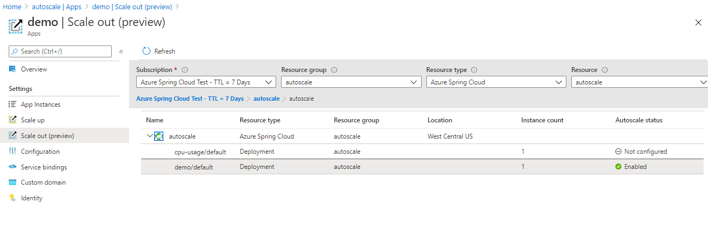
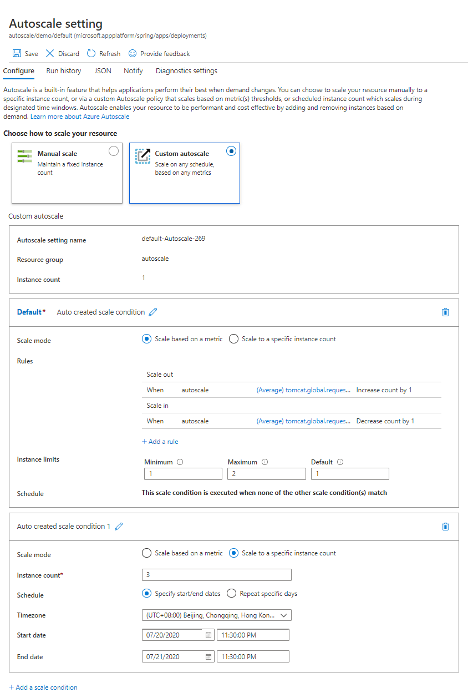

Autoscale is a built-in feature of Azure Spring Cloud that helps microservice applications perform their best when demand changes.

This article describes how to set up Autoscale settings for your applications in the Microsoft Azure portal and Azure CLI.

# Prerequisites

To follow these procedures, you need:

* An Azure subscription. If you don't have an Azure subscription, create a [free account](https://azure.microsoft.com/free/?WT.mc_id=A261C142F) before you begin.
* A deployed Azure Spring Cloud service instance. Follow the [quickstart on deploying an app via the Azure CLI](https://docs.microsoft.com/en-us/azure/spring-cloud/spring-cloud-quickstart-launch-app-cli) to get started.
* At least one application already created in your service instance.

# Navigate to the Autoscale page in the Azure portal

1. Sign in to the [Azure portal](https://portal.azure.com/).
2. Go to your Azure Spring Cloud **Overview** page.
3. Select the resource group that contains your service.
4. Select the **Apps** tab under **Settings** in the menu on the left side of the page.
5. Select the application you want to set up Autoscale. In this example, select the application named **demo**. You should then see the application's **Overview** page.
6. Go to the **Scale out (preview)** tab under **Settings** in the menu on the left side of the page.
7. Select the deployment you want to set up Autoscale. You should see options for Autoscale shown in the following section.



# Set up Autoscale settings for your application in the Azure portal

* Manual scale: Maintain a fixed instance count. In the Standard tier, you can scale out to a maximum of 500 instances. This value changes the number of separate running instances of the microservice application.
* Custom autoscale: Scale on any schedule, based on any metrics.



# Set up Autoscale settings for your application in Azure CLI

* Create Autoscale setting
  ```
  az monitor autoscale create -g demo-rg --resource /subscriptions/ffffffff-ffff-ffff-ffff-ffffffffffff/resourcegroups/demo-rg/providers/Microsoft.AppPlatform/Spring/autoscale/apps/demo/deployments/default --name demo-setting --min-count 1 --max-count 5 --count 1
  ```
* Create Autoscale rule
  ```
  az monitor autoscale rule create -g demo-rg --autoscale-name demo-setting --scale out 1 --cooldown 1 --condition "tomcat.global.request.total.count > 100 avg 1m where AppName == demo and Deployment == default"
  ```

# Upgrade to the Standard tier

If you are on the Basic tier and constrained by one or more of these limits, you can upgrade to the Standard tier. To do this go to the Pricing tier menu by first selecting the Standard tier column and the clicking the **Upgrade** button.

# Next steps

* [Overview of autoscale in Microsoft Azure](https://docs.microsoft.com/en-us/azure/azure-monitor/platform/autoscale-overview)
* [Azure CLI Monitoring autoscale](https://docs.microsoft.com/en-us/cli/azure/monitor/autoscale?view=azure-cli-latest)